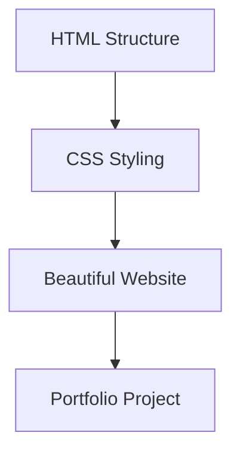

# Getting Started with CSS

## Overview

This video introduces **CSS (Cascading Style Sheets)** — a core technology used in web design to control how web pages look and feel.
It explains why CSS is essential for transforming plain HTML pages into visually appealing and professional websites.

---

## Main Concepts

### 1. What is CSS?

**CSS (Cascading Style Sheets)** is the language used to style and design web pages.
It defines how elements should be displayed — such as **colors, fonts, layouts, and spacing**.

Without CSS, web pages appear as **plain text on a white background**.

**Example:**

```html
<p>This is a simple paragraph.</p>
```

Without CSS, it looks basic.
With CSS:

```css
p {
  color: blue;
  font-size: 18px;
  background-color: lightyellow;
}
```

Now the text appears more styled and readable.

**Explanation:**
CSS helps web designers make websites attractive, organized, and user-friendly.

---

### 2. Why Learn CSS?

Learning CSS allows you to:

* **Enhance existing websites** by changing colors, layouts, and styles.
* **Build professional designs** from scratch.
* **Customize themes** on platforms like **Squarespace or WordPress**.
* **Prepare for a web design or development career** by mastering design control.

---

### 3. What You’ll Learn in This Course

By following this course, you will:

* Learn the **foundations of CSS** step by step.
* Practice writing your own CSS rules.
* Build a **final project** — a **personal portfolio and resume website**.
* Understand how to integrate CSS with HTML effectively.

---

## 🔑 Key Points / Notes

* **CSS controls the visual appearance** of web pages.
* It can be used to **style existing websites** or **create new designs**.
* Learning CSS gives you creative control over how your web projects look.
* The course project: **Online portfolio and resume page.**

---

## 🧩 Visual Summary



---

## ⚡ Quick Revision

✅ **CSS = Style language for the web**

✅ Transforms plain HTML into modern, appealing designs

✅ Essential skill for anyone in web development or design

✅ Final goal: Build your own **online portfolio** using CSS

---

## 🧩 Input Transcript

*Getting started with CSS
CSS is a fundamental part of web design because it controls how your webpages look. Without it, websites would only display text on white backgrounds. Use CSS to take your plain HTML websites to the next level. Whether you're just trying to customize your Squarespace page or contemplating a career switch, learning the essentials of CSS from the ground up gives you the ability to do everything from tweaking existing CSS to writing your own. By the end of this course, you'll have an actual project—an online portfolio and resume page. I'm Christina Truong, and I invite you to join me from my course on LinkedIn Learning where I'll cover the foundations of CSS. Let's get started.*
