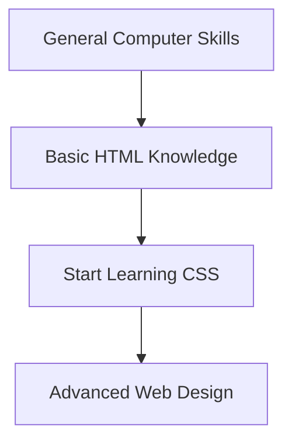

# What You Should Know Before Learning CSS

## Overview

This video explains the **prerequisites for learning CSS**. It helps learners understand what prior knowledge or skills will make the learning process smoother and more effective. The instructor emphasizes that you can start CSS as a beginner, but knowing some basics will give you an advantage.

---

## Main Concepts

### 1. No Prior CSS Knowledge Required

You can start learning **CSS (Cascading Style Sheets)** from scratch — no previous experience is necessary. The course is designed for complete beginners.

However, having some familiarity with **HTML** (HyperText Markup Language) will make it easier to follow along.

**Example:**

```html
<h1>Hello, World!</h1>
<p>This is my first paragraph.</p>
```

CSS will later be used to style these elements.

**Explanation:**
CSS and HTML work together. HTML creates the structure of a webpage, and CSS controls how it looks (color, layout, font, etc.).

---

### 2. Helpful Skills Before Starting

While you don’t need to be a developer, it’s beneficial to be **comfortable with general computer tasks**, such as:

* Creating and organizing **files and folders**.
* Using **multiple applications at once** (like a browser and code editor).
* Navigating your **computer’s file system**.

**Why it matters:**
These skills will help you when working with **code editors**, managing **project folders**, and previewing your websites in browsers.

---

### 3. Recommended Next Step: HTML Essentials

If you find yourself struggling with HTML concepts while learning CSS, the instructor recommends checking out the **“HTML Essential Training”** course first.

It will give you a solid understanding of how web pages are structured — which directly helps when applying CSS styling.

---

## 🗝️ Key Points / Notes

* You can start CSS without prior experience.
* A **basic understanding of HTML** is highly beneficial.
* Be comfortable with **file management** and **multitasking** on your computer.
* If unsure about HTML, take the **HTML Essential Training** course.

---

## 🧩 Visual Summary



---

## ⚡ Quick Revision

```
✅ No CSS experience needed — this course starts from zero.
✅ Know some **HTML** to make CSS easier to learn.
✅ Be comfortable creating files and folders on your computer.
✅ If you’re new to HTML, start with **HTML Essential Training**.
```

---

## 🧩 Input Transcript

*We'll be learning about CSS from the ground up, so you don't need any prior knowledge. However, having a basic understanding of HTML and being comfortable with general computer tasks such as creating files and folders or using multiple apps simultaneously, will help you get the most out of this course. If at any point you have any questions about HTML, I'd encourage you to check out our "HTML Essential Training" course.*
