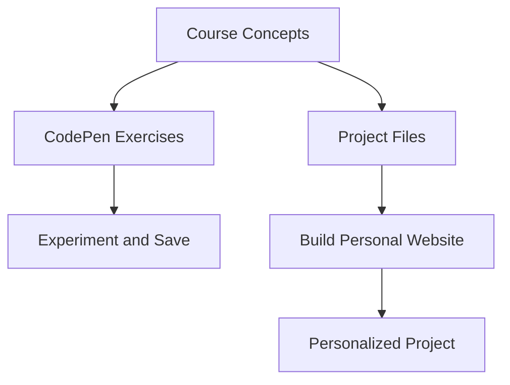

# How to Complete the Exercises in CSS

## Overview

This video explains **how to work on exercises** throughout the CSS course. Completing these exercises helps you **practice CSS concepts**, experiment with code, and build a **real project** — a two-page personal website.

---

## Main Concepts

### 1. Two Exercise Formats

The course provides exercises in **two formats**:

#### a) Small Code Samples

* Used to **practice specific CSS techniques**.
* Hosted on **CodePen**, an online platform to **experiment and see results instantly**.
* **Optional sign-up:** You don't need an account, but if you want to save your work:

  * Click the **Fork button** on CodePen.
  * This creates a **personal copy** of the exercise in your account.

**Example:**

```css
p {
  color: green;
  font-size: 20px;
}
```

* Try this snippet on CodePen to see the **green text** applied immediately.

---

#### b) Full Project Exercises

* A **two-page personal website** that you will **build and personalize**.
* **Starter files:** Download from the exercise files to get project structure and resources.
* **File indicators:**

  * Not all videos have exercise files.
  * Videos with exercise files are marked by **chapter and movie number**.
  * Folders named **personal-site** indicate the **final project structure** for that video.
* **Purpose:** Practice building a real website and use CSS in context.

---

### 2. Additional Resources

* **Links.pdf** file included in the course:

  * Contains **all online resources** mentioned in the course.
  * Includes **extra readings** for deeper understanding.
* **CodePen examples**: Accessible for experimenting and reference.

---

## 🗝️ Key Points / Notes

* Exercises help **practice CSS concepts** step by step.
* Two formats:

  * **CodePen snippets** — quick, interactive practice.
  * **Project files** — build and personalize a real website.
* **Links.pdf** contains all useful resources and extra readings.
* **Fork CodePen** to save personal copies of exercises.

---

## 🧩 Visual Summary



---

## ⚡ Quick Revision

✅ Two exercise types: small **CodePen snippets** and **full project files**
✅ Use **CodePen Fork** to save your own copy
✅ Download **starter files** to build your personal website
✅ Refer to **Links.pdf** for resources and extra readings

---

## 🧩 Input Transcript

*As we're going through the course I'll be giving you exercises to work on in two formats. The first will be small code samples. I'll be using an online tool called CodePen, which is great for experimenting and seeing the output right away. All of the CodePen exercises will be included in my CSS Essential Training collection. You're not required to sign up for this service, but if you'd like to keep a personal copy of the exercise you'll need to create a free account. To save your own copy select this Fork button and it will create a personal copy in your account. The second format will be building out an actual project, a two-page personal website. Download the exercise files to get access to the starter files and other resources needed for the course project. Not all videos will have exercise files, but for the ones that do, they are marked by chapter and movie number. The folders marked personal-site indicate the end state of the course project for that video's exercise. You will be building out and personalizing your own site, but these project files can be used for reference. Lastly, we'll be linking to a lot of online resources and CodePen examples. So for your convenience we've also included a Links.pdf file. This contains all the links to resources I mentioned throughout the course as well as extra readings.*
