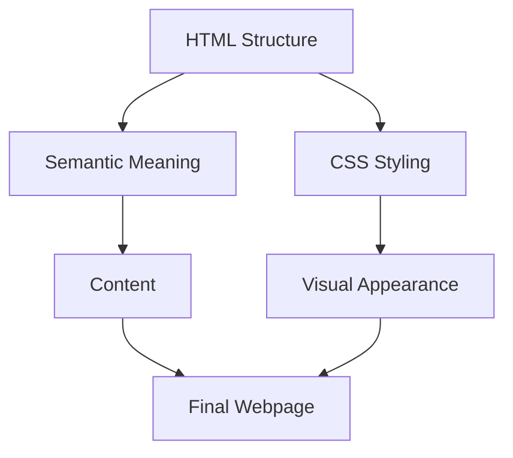

# HTML and CSS Fundamentals

## Overview

This video explains the relationship between **HTML and CSS**. It highlights why CSS is essential for styling web pages and why HTML is primarily used for defining structure and meaning. The course focuses on CSS, but basic HTML understanding is included for context.

---

## Main Concepts

### 1. HTML Basics

**HTML (HyperText Markup Language)** is used to create the **structure of web pages**.

* Originally designed for sharing research documents.
* Default browser styles include things like spacing between paragraphs and bold headings.
* **Important:** Don't choose an HTML element just for how it looks; use it for its **semantic meaning**.

**Example:**

```html
<h1>My Portfolio</h1>
<p>Welcome to my personal website.</p>
```

**Explanation:**

* `<h1>` defines the main heading (semantic importance).
* `<p>` defines a paragraph.
* CSS will later control how these elements look (font, color, spacing, etc.).

---

### 2. CSS Basics

**CSS (Cascading Style Sheets)** controls the **appearance and presentation** of HTML elements.

* Separates content (HTML) from presentation (CSS).
* Allows you to customize colors, fonts, layout, and spacing.

**Example:**

```css
h1 {
  color: navy;
  font-size: 36px;
}
p {
  color: gray;
  line-height: 1.6;
}
```

**Explanation:**

* The `<h1>` heading is styled in **navy color** and larger size.
* Paragraph `<p>` text is **gray** with increased line spacing for readability.

---

### 3. Course Project & Setup

* We'll be building a **personal website** as a real-world project.
* Before starting CSS essentials, we will:

  * Set up a **development environment** (code editor, browser preview).
  * Prepare **project files** for practice.
* HTML will be used in the project, but **CSS styling** is the main focus.
* For additional HTML learning, refer to **HTML Essential Training**.

---

## 🗝️ Key Points / Notes

* HTML defines **structure and meaning**, CSS defines **style and appearance**.
* Avoid using HTML elements for visual appeal — use CSS for that.
* Course focuses on **CSS fundamentals**, but HTML context is provided.
* A **personal website project** will help practice both HTML and CSS.

---

## 🧩 Visual Summary



---

## ⚡ Quick Revision

✅ HTML = structure and meaning of content
✅ CSS = style and presentation of elements
✅ Avoid using HTML for appearance
✅ Set up your development environment and project files before starting CSS
✅ Personal website project will integrate HTML and CSS practice

---

## 🧩 Input Transcript

*In this course we'll be focusing on the fundamentals of CSS, but we'll also have discussions about HTML because these two languages work closely together. HTML was originally created for sharing research documents. So the space between paragraphs and bold headings are examples of default browser styles which were created to make text easier to read. Though HTML elements are displayed with these basic styles, avoid choosing a particular element because of the way it looks. That's what CSS is for. Instead use HTML to define the structure of the document and add meaning to the content. CSS, on the other hand, controls the appearance of the document and separates presentation from the content. Throughout this course, we'll be working with HTML, but it's not the focus. And as you're following along, if you have any questions about HTML that we're not covering, I would encourage you to check out HTML Essential Training for more details. We'll also be building out a real world project, a personal website. So before getting into the essentials of CSS, we'll start with an overview of how to set up a development environment and prepare our course project files.*
