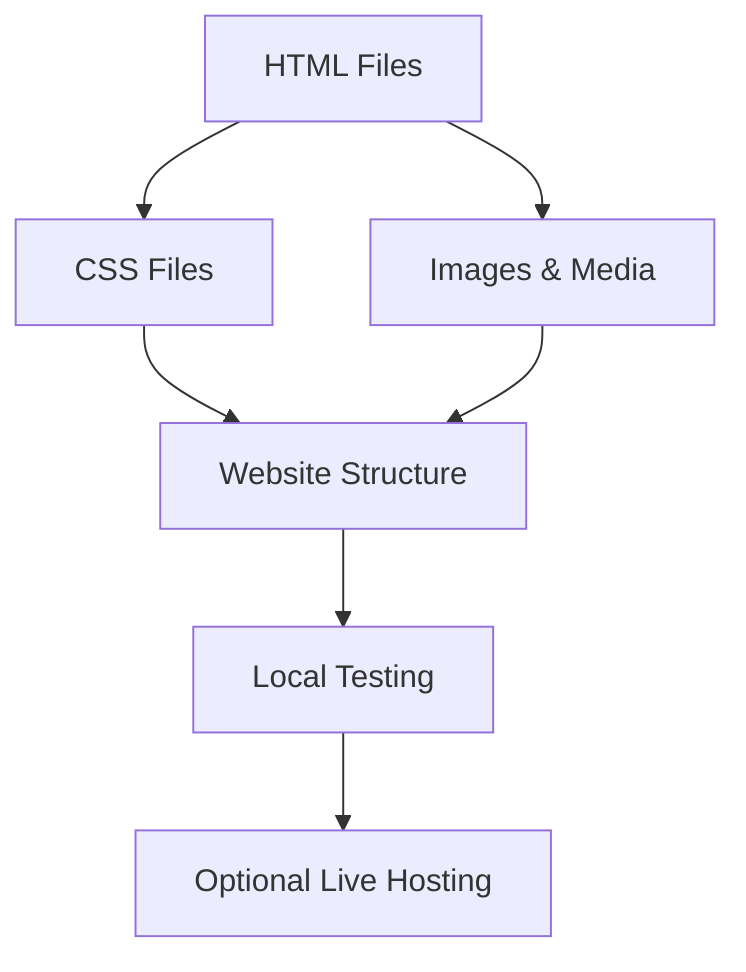

# Working with Website Files

## Overview

This video explains how websites are structured as **collections of files** and how these files are organized, named, and linked together. Understanding this is essential for building and managing websites effectively.

---

## Main Concepts

### 1. Single-page vs Multi-page Websites

* **Single-page websites:** All content is on one HTML page, divided into sections.
* **Multi-page websites:** Related content is spread over multiple HTML pages.
* Both types use **HTML, CSS**, and other resources like **images, videos, and PDFs**.

**Example:**

```text
index.html  -> homepage
about.html  -> about page
contact.html -> contact page
```

---

### 2. File Types and Extensions

* **HTML files:** `.html` (structure/content)
* **CSS files:** `.css` (styling)
* **Images:** `.jpg`, `.png`, `.gif`
* **Videos:** `.mp4`, `.webm`
* **Documents:** `.pdf`

**Explanation:**
Each file type serves a specific purpose in a website.

---

### 3. Working Locally

* Start by creating and editing files **on your computer**.
* Test changes locally **before making the website live**.
* Files are stored in **folders (directories)**.
* The **root directory** usually contains HTML files.
* Other files are stored in **subfolders** based on their type or purpose.

**Example Folder Structure:**

```text
personal-website/
├── index.html
├── about.html
├── css/
│   └── style.css
├── images/
│   └── profile.jpg
```

---

### 4. File Naming Conventions

* Avoid spaces and symbols in file names.
* Use **underscores** `_` or **hyphens** `-` to separate words.
* Prefer **lowercase letters** to prevent server issues.
* Use **meaningful names** for easier identification and better SEO.

**Example:**

```text
good: personal-photo.jpg
bad: Personal Photo!.JPG
```

---

### 5. Linking Files

* Linking is essential to connect HTML with CSS, images, or other pages.
* Maintain a **consistent folder structure** to simplify linking.

**Example:**

```html
<link rel="stylesheet" href="css/style.css">

<a href="about.html">About Me</a>
```

---

### 6. Making a Website Live

* Files from the **root folder** are uploaded to a **web server**.
* A **domain name** is needed to access the website.
* Web hosting companies provide access to servers.
* Browser-based editors (e.g., **Glitch**) automatically host files online.
* **CodePen** is used for smaller exercises or experimental projects.
* For realistic workflow, we use a **local text editor** for the course project.
* This mirrors typical **web developer workflow**.

**Note:** This course focuses on building files locally; making websites live is covered in another course.

---

## 🗝️ Key Points / Notes

* Websites are collections of **HTML, CSS, and other resource files**.
* Files are stored in **root and subfolders**.
* Follow **consistent file naming conventions** for SEO and ease.
* Linking files is essential for a working website.
* Use **local text editors** for realistic development experience.
* **Online editors** like CodePen are ideal for small experiments.

---

## 🧩 Visual Summary



---

## ⚡ Quick Revision

✅ Websites = collection of files (HTML, CSS, images, videos)
✅ Root folder = main HTML files; subfolders = CSS, images, other resources
✅ File names: lowercase, use hyphens/underscores, meaningful
✅ Link files properly to ensure site works
✅ Local editing mirrors real web development workflow
✅ Online editors (CodePen, Glitch) for experiments and small exercises

---

## 🧩 Input Transcript

*The web started out as digital copies of text-based research documents, but has since grown into a lot more and can be viewed on a variety of devices. Websites can be designed as a single page with content divided into sections within the same HTML page. For multi-page websites related content is spread out over multiple HTML pages. These webpage are written using coding languages such as HTML and CSS, and contain other web resources such as images. When creating a website, you're basically creating a collection of files which are embedded or linked to each other. These different types of files are saved with specific file extensions. For example, HTML is contained within .HTML files, CSS in .CSS files. Other web resources like images, videos, or PDFs also have their own file extensions. Developing a website from scratch usually starts with creating and working on these files locally, on your computer. That way, you can make changes and test them in your own workspace before making your website available to the public. These files are stored in various folders, also referred to as directories. The main folder is referred to as the root directory, which is where HTML files are generally stored. Other files are usually grouped into related sub folders. Linking to files is an important part of building a website, so it's equally important to follow a consistent structure. Here are some conventions that can be followed when naming files. Spaces and symbols should be avoided, with the exception of underscores and hyphens, which can be used to separate words. Just note that Google's Search Engine Optimization Guide recommends separating words with hyphens. Some servers will also interpret different letter casing as different names, so skip the unnecessary headaches and keep it consistent by using all lowercase letters. Also, using meaningful and descriptive names is recommended for SEO, and it also just makes it easier for us to identify which file is used for what. When you're ready to go live with your website, all the files contained within the root folder are uploaded to a web server, so these naming conventions don't apply to the root folder, but you might as well get into the habit of keeping it consistent for the entire project. To make a website live, you'll also need a domain name, which is the address of the website. The server stores the web files, and the web-hosting companies provide access to these servers. However, if you use a browser-based text editor such as Glitch, these tools are already online and live. Each project is automatically assigned a unique URL, which anyone can view. We'll also be using a another online editor, CodePen, for smaller exercises. This will allow us to focus on individual concepts. Online text editors are ideal for experimental projects and working on small code snippets. For the course project, however, we'll be using a text editor to work on our files locally to build out our personal websites. This process mirrors the typical workflow of a web developer, giving you a more realistic experience. In this course, we won't be making our websites live, but if you're interested in learning about the different ways to publish a website, check out my course, "Getting Your Website Online.*
