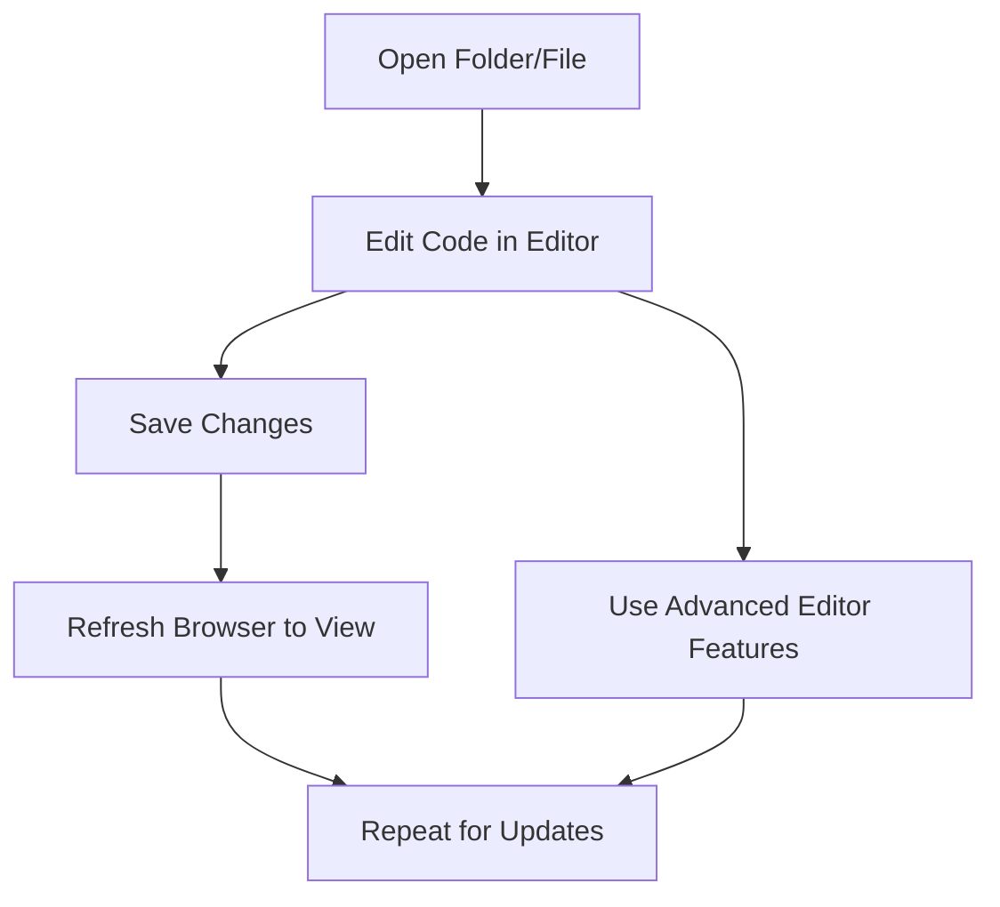

# Writing Code with a Text Editor

## Overview

This video explains how to use a **text editor** to write and edit code effectively. Text editors are essential tools for web development, and learning to use them properly improves productivity.

---

## Main Concepts

### 1. Importance of Text Editors

* Text editors are used to **write and edit code**.
* **Basic editors:** Notepad (Windows), TextEdit (Mac) – pre-installed but limited features.
* **Advanced editors:** Visual Studio Code (VS Code), Sublime Text, Atom.
* **VS Code** is the most popular according to the 2022 Stack Overflow Developer Survey.

**Use case:** Advanced editors provide syntax highlighting, file management, and extensions to improve workflow.

---

### 2. Setting up VS Code

* **Download VS Code** to follow along with exercises.
* If you already have a preferred editor, it works too, but features may vary.
* First-time setup may include a **walkthrough page**.
* You can start with a **blank editor** by disabling the "show welcome page on startup" option.

---

### 3. Opening Files and Folders

* **Open an entire folder** to work on multiple files at once.
* Menu options: `File > Open` or `File > Open Folder`.
* Security popups may appear; you can choose not to save workspace settings.
* **Open a single file** by double-clicking it in the sidebar.

**Example:**

```text
project-folder/
├── index.html
├── about.html
├── css/
│   └── style.css
```

* Opening the folder loads all files for easy access.

---

### 4. Editing and Saving Files

* Make changes to the code directly in the editor.
* **Always save changes** before viewing in the browser.
* Menu option: `File > Save` or keyboard shortcuts:

  * Mac: `Command + S`
  * Windows: `Control + S`
* Frequent saving prevents losing updates or confusion.

**Example Edit:**

```html
<h1>Welcome to My Website!</h1>
```

* Add or modify text, then save and refresh the browser to see updates.

---

### 5. Viewing in Browser

* Open HTML files in a browser to see changes.
* Double-click the file in **Finder (Mac)** or **File Explorer (Windows)**.
* Supported browsers: Firefox, Chrome, Edge, Safari.
* Refresh the page after saving changes to view updates.

---

### 6. Advanced Editor Features

* VS Code provides:

  * Syntax highlighting
  * Code suggestions
  * Extensions for productivity
  * File management within projects
* These features enhance **development workflow** and efficiency.
* The course will explore more VS Code features progressively.

---

## 🗝️ Key Points / Notes

* Text editors are **essential for coding**.
* **VS Code** is widely used and recommended.
* Open entire folders for **multi-file projects**.
* Always **save your files** to see changes.
* Open HTML files in a **browser** to view results.
* Advanced editors provide features to **boost workflow**.

---

## 🧩 Visual Summary



---

## ⚡ Quick Revision

✅ Use a text editor to write and edit code.
✅ VS Code is recommended for its advanced features.
✅ Open folders to manage multiple files.
✅ Save frequently using `Command/Control + S`.
✅ Refresh browser to see changes.
✅ Advanced editor features improve workflow.

---

## 🧩 Input Transcript

*Text editors are an essential tool for writing and editing code. Notepad or TextEdit are basic editors that are usually pre-installed on your computer. While they can be used to write code, they lack advanced features. The results of the 2022 Stack Overflow Developer Survey shows that there are many free and paid options to consider, with Visual Studio Code currently being the most popular editor. For this course, I'll be using VS Code as well. Take a moment to download it now to follow along with the exercises. If you already have an editor that you prefer, that works too. Just keep in mind that the user interface and features may be different. Also, this is how VS Code looks at the time of this recording. The layout and features of this editor may also change over time, as do many other tools and software. If you're opening VS code for the first time, you may see some kind of setup page which will generally only show on new installs. It includes an optional walkthrough for setting up the editor. But if you click on the welcome link, this will take you to the main welcome page. This is what you'll see when you open the editor moving forward. You'll still be able to see the setup page by selecting the walkthrough link. The editor can also be customized in the settings which I'll be going through shortly. I personally don't use the welcome page and prefer to start with a blank editor. So to change that setting, just go back to the main welcome page and deselect show welcome page on startup option. Then close this start page by clicking the X in the tab. Now let's open the example HTML file located in the exercise files in the 01_03 folder. Let's strike the whole folder into the editor. You may see some kind of security popup or a popup asking if you want to save your workspace configuration. Let's just say don't save for now. You can just open up one file rather than the whole folder but since most projects contain multiple files, dropping the whole folder in will add all the files at once. You can also choose the menu option, file, open, or open folder, and navigate to your files from there. If your HTML file hasn't already opened, you can always double click on it from the sidebar. To view the file in the browser, go to your finder on Mac or File Explorer on PC. Double click on the file to open it in your default browser. I'll be using Firefox. Now let's change some texts just to make an update. So let's go back to the editor and in the index.html file, I'm just going to add some exclamation marks just to make a change. Remember to save the file once you've made any changes. I can't tell you how many times I thought something was wrong with my revisions, only to realize I just forgot to save the file. So you can use the menu option file, save, or use the keyboard shortcut, command S on a Mac or control S on a PC. I prefer using the shortcut since I save my files quite often. Now we'll go back to the browser and refresh it to see the changes. That's pretty much the basics of using a text editor to write and view your code. But with an advanced text editor, like VS Code, we can access more features to improve your development workflow. We'll continue to explore the editor features throughout this course.*
