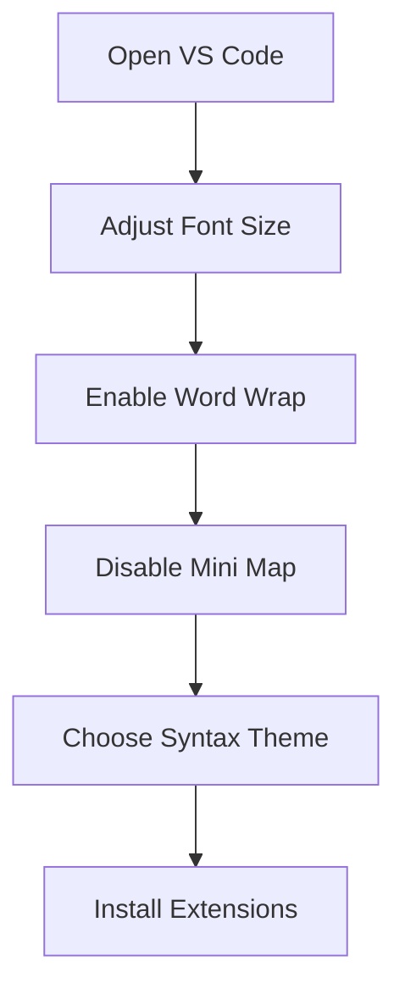

# Customizing Your Text Editor (VS Code)

## Overview

This video teaches how to customize a text editor, specifically VS Code, to improve your coding experience. Customizing settings like font size, word wrap, themes, and extensions helps make coding more comfortable and efficient.

## Main Concepts

### 1. Adjusting Font Size

* **Quick Method:**

  * **Mac:** `Command +` or `Command -`
  * **PC:** `Control +` or `Control -`
  * This changes both the code and UI elements.
* **File Display Only:**

  * Click the **gear icon** > **Settings** > **Editor: Font Size**
  * Set your preferred size (e.g., 18)

**Example:**

```text
Before: small text
After: text size increased to 18
```

### 2. Enabling Word Wrap

* Prevents horizontal scrolling.
* Settings:

  * **Editor: Word Wrap** > `on` (wraps text to editor width)
  * Other options: `wordWrapColumn` (specific width), `bounded` (smaller of window width or column width)
* Recommended: **on** for basic wrapping.

### 3. Disabling Mini Map

* Mini map shows a small overview of code on the right.
* Can be distracting or take space.
* Disable by:

  * Right-click in editor > Uncheck **Mini Map**
  * Or search **Mini Map** in settings.

### 4. Syntax Highlighting

* Differentiates code elements with colors:

  * HTML tags, attributes, and content have unique colors.
  * Clicking a tag highlights its matching pair.
* Change theme:

  * **Gear icon** > **Themes** > **Color Themes**
  * Example: Monokal Dimmed theme.
* Install additional themes:

  * Sidebar > Extensions (four blocks icon) > Search & Install

### 5. Exploring Other Features

* VS Code has many customizable features.
* Check **documentation** or **preference settings** for more options.

---

## 🗝️ Key Points / Notes

* Adjust **font size** for readability.
* Use **word wrap** to avoid horizontal scrolling.
* Disable **mini map** if you need more coding space.
* **Syntax highlighting** helps differentiate code elements.
* Explore **themes and extensions** to enhance workflow.

---

## 🧩 Visual Summary



---

## ⚡ Quick Revision

✅ Customize VS Code to fit your workflow
✅ Font size, word wrap, mini map, syntax highlighting
✅ Themes and extensions enhance coding experience
