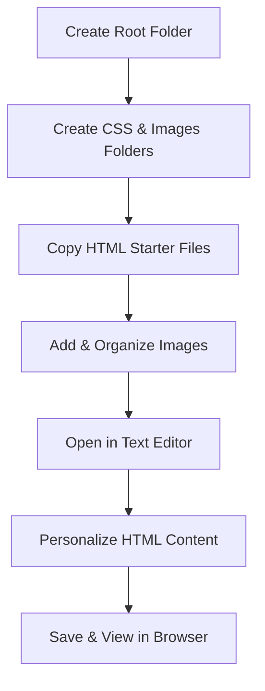

# CSS Project: Overview and Setup

## Overview

This video teaches how to set up a two-page personal website project for learning CSS. It covers creating folders, adding HTML files, managing images, and customizing the project content before styling.

## Main Concepts

### 1. Project Structure

* **Root folder:** Create a main folder (e.g., `personal-site`) on your computer.
* **Subfolders:** Inside the root, create a `css` folder for styles and an `images` folder for all images.
* **Naming conventions:**

  * Use **all lowercase letters**.
  * Avoid spaces; use **hyphens** or **underscores**.
  * Use descriptive names for better organization and SEO.

### 2. Adding HTML Files

* Use starter files: `index.html` and `resume.html`.
* Copy these into your project folder to have backups.
* Templates help focus on CSS while still allowing content edits.
* **Personalization:** Update title tags, headings, and sections with your name, tagline, and bio.

### 3. Managing Images

* Starter images include background options (`BG` prefix), placeholders for project thumbnails, and social media icons.
* Copy only the images you will use into your `images` folder.
* You can add or delete images later as the project develops.
* Upcoming lessons will cover optimizing images for web.

### 4. Opening Project in Text Editor

* Close any unnecessary example files or sidebars.
* Drag and drop the `personal-site` folder into your text editor (VS Code recommended).
* Open `index.html` and `resume.html` in the editor for editing.

### 5. Personalizing HTML Content

**Homepage (`index.html`):**

* Update **title tag** (e.g., your name and job title).
* Update **H1** and **H2** with your name and tagline.
* Add your **bio** in the About section.
* Ensure footer includes consistent copyright and social media links.
* Link to resume page.

**Resume Page (`resume.html`):**

* Copy homepage title to resume title, start with `Resume -` for distinction.
* Add name and title in header.
* Profile section: short summary with link back to homepage.
* Add work experience, education, and projects by duplicating provided HTML blocks.
* Update only text content for now; images will be handled later.

### 6. Viewing Changes

* Save files frequently: `Command+S` (Mac) or `Ctrl+S` (PC).
* Open files in browser (double-click or drag to browser) to see updates.
* Start with placeholder text if needed (e.g., meettheipsums.com).
* Navigation is via links between homepage and resume (no menu needed for two-page project).

---

## 🗝️ Key Points / Notes

* Keep a clear folder structure with lowercase, descriptive names.
* Always save your files before viewing updates in the browser.
* Customize text content first; images and CSS styling come later.
* Use placeholders if real content isn’t ready.

---

## 🧩 Visual Summary



---

## ⚡ Quick Revision

```
✅ Root folder with `css` and `images` subfolders
✅ Copy starter HTML files and images
✅ Personalize title, headings, bio, and footer
✅ Save and refresh in browser frequently
✅ Use placeholder text if needed
```

---

## 🧩 Input Transcript

<details>
<summary>Click to expand transcript</summary>

[Project: Overview and setup

* [Instructor] In this course, we'll learn CSS by building out a two page personal website step-by-step. Here's an example of what the finished project will look like. It will include an About Me homepage and a Resume page. While you can build out the design as you go along, it's easier to have an idea of what the finished website will look like to use as a guide. In web design and development, this is called a mockup. They can be simple sketches or more detailed designs. For this course, I'll be referring back to this final version to use as our guide as we build out the project. It can also be found in the exercise files in a folder named Final. Let's start by setting up the project files. First, we'll create the root folder. I'll add mine to my desktop. Right click new folder and name it something descriptive. I'll call mine personal site. Then let's open this folder and create a CSS folder and an images folder. And remember to use all lower case letters and don't include any spaces. Now, we'll add the HTML files, which can be found in the starter files folder in the exercise files. Since this isn't a course on HTML specifically, I've created a template. That way, we can spend more time focusing on CSS. However, we'll still be working with some HTML to update the content, but this will help us get up and running more quickly. So let's make a copy of both the index and resume.html files and save them to your project folder. You'll have the original files as a backup in case you want to restart the project. Right click copy and right click paste. We'll also need some images. Starter files include some stock photography options you can use. The images with the BG prefix indicate that they can be used as a background image for the homepage and resume header. The project images are placeholders for the project thumbnails. And the icon logos are for the social media links in the footer. Since we're just starting the project, you probably don't know what images you want to use yet, so you can just copy all of them to your folder. And when you've done the project, just delete the ones you're not using. I'll add just the files I'll be using from my project, which is the BG home office studio, and the icons. Copy these files and paste them into my images folder. I'll be using my own project thumbnails, so I won't need these placeholder options. In the upcoming lessons, I'll go over where to find and how to optimize images for the web in more detail. Now, let's add the project to the text editor to start making changes. If you still have the example files or the setting tabs open, let's just go ahead and close them. And if you have the extension sidebar open, just click the file icon to go back to the file view. Then we're going to drag and drop the personal site folder into the text editor window. In the sidebar, double click both the index and resume.html files to open them in the editor. Let's review what's included and how you can personalize the project. I encourage you to customize the content but keep the HTML structure the same to follow along with the project exercises. Let's start by taking a look at index.html. First thing we should update is the title tag. It should be something that describes your page like your name and job title. I like adding a comma or a slash or this pipe symbol to separate the name and the title. In the intro section, update the H1 and H2 with your name and tagline as well. In the rest of the HTML, I've added comments to organize and include instructions for customizing the content. In the about section, you can add your bio here. Use as many paragraphs or links as you need as long as it stays within the main tags. And make sure to leave the link here to the resume page. The footer includes copyright and contact information, as well as the social media links. It should be consistent on both the home and resume pages so make sure any changes are added to both HTML files. Let's save this file and open it in the browser. You can double click on the file or just drop it into the browser. We can see the updated H1 and H2 content. And the updated title content can be seen in the browser tab. Let's go back to the editor and look at the resume HTML. But before I do that, I'm going to copy the content in the title tag. I'll add it to the title tag in the resume page as well but I'm going to start with resume at the beginning just to describe this page a little bit differently from the homepage. You can add your name and title again to the header section. Next is the profile section, which can be used as a short summary. Just like the homepage, make sure to leave this link here to get back to the homepage from the resume page. For the next sections of the resume, the template includes one sample item. For example, to add more projects, just copy the block of HTML within the comment instructions and paste it underneath. I've included image tags here in the template, but don't worry about updating them just yet. For now, take a moment to personalize just the text-based content. We'll tackle the images in the next exercise. For the work experience and education sections, you can add additional items as well by copying and pasting the blocks of HTML within the comments. Feel free to delete the instructions after you're done or leave them there as guides. Let's save this file and see the changes in the browser. Since the website is only two pages, I didn't include a navigation menu. Instead, users can get to the resume page using the link in the about me section. From the resume page, they can go back to the homepage by using this link in the profile section or they can just click back in the browser. If we had more pages, a navigation menu would make sense, but for now, I think keeping it simple works fine. Keep your editor and browser open for the remainder of this course since we'll be making updates as we go along. If you're not sure what to write yet, try using placeholder text. Meettheipsums.com has a list of text generators you can use to add text blocks. Having realistic content gives you context, which can help when adding styles. Here's my updated and personalized HTML content. Since we haven't added any CSS yet, what we see here is just the default browser styles. Once you finish customizing your content, you're ready for the next lesson.]

</details>
