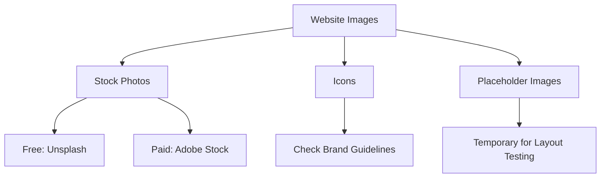

# Where to Find Images for Your Website

## Overview

This video explains where to find images and icons for your website. Using high-quality visuals improves the design and user experience. You'll learn about stock photos, icons, licensing, and placeholder images.

## Main Concepts

### 1. Stock Photography

**Definition:** Professional photos taken by photographers that can be licensed for use.

* **Paid Options:** Adobe Stock provides photos, illustrations, videos, templates, and more.
* **Free Options:** Unsplash offers a wide variety of free, high-quality photos.
* **Use Case:** Perfect for homepage banners, blog posts, or sections requiring professional visuals.

**Tip:** Always check the license and attribution requirements.

---

### 2. Icons for Navigation and Social Media

**Definition:** Small graphics used to represent actions or brands (like social media links).

* **Resources:** Iconfinder provides free and premium icons, filterable by style and license.
* **Brand Guidelines:** Many social media platforms have strict rules for using their logos (e.g., Twitter).
* **Example:** Twitter logo must not be altered or outdated.

**Tip:** Follow brand usage guidelines to avoid legal issues.

---

### 3. Placeholder Images

**Definition:** Temporary images used during development until real images are available.

* **Example Service:** Loren Picsum allows selecting photos, dimensions, and styles via URLs.
* **Use Case:** Helpful for testing layout and design.
* **Limitation:** If the service goes down, the images will disappear.

**Tip:** Use realistic placeholder images to better visualize the final website.

---

## 🗝️ Key Points / Notes

* Stock photos improve website design and are available in free and paid options.
* Icons enhance navigation and brand recognition but check usage guidelines.
* Placeholder images are temporary tools for layout testing.
* Always verify licenses and attribution requirements before using any image.

---

## 🧩 Visual Summary

---

## ⚡ Quick Revision

✅ Stock photos: Professional visuals, free or paid.
✅ Icons: For navigation/social media, follow brand rules.
✅ Placeholder images: Temporary, for testing layouts.
✅ Always check license and attribution.

---

Input Transcript

[Where to find images

* [Instructor] Using your own photos is a great option, but it's not always possible to create high-quality graphics on your own. So let's talk about where to find images for your website. A popular option is to use stock photography, which are a collection of photos typically taken by professional photographers that can be licensed for specific uses. For navigation elements and social media links, icons can also be used to add visual interest. There are also paid services such as Adobe Stock, which gives you access to photos, as well as illustrations, videos, templates, and more. But if you're looking for a simple and free option, Unsplash is pretty good too. For icons, Iconfinder has filters for free and premium icons, styles, and licenses. Just do a search for what you're looking for to see all the options. Speaking of licenses, even if an image or icon is free, make sure to check for any copyright, usage, or attribution requirements. This information is usually included on the website or with the download in a text file. When using icons, you'll often find branded company logos. For example, let's do a search for the Twitter logo. We can see different variations for the logo, but many organizations actually have specific usage restrictions. Here are the guidelines for the Twitter logo. If we scroll through the document, we'll see guidelines for how to use the Twitter logo, specifically that it must not be changed in any way or use any out of date versions. Truthfully, I'm not sure what will happen if you're caught violating these rules but most likely you'll be asked to remove the content. So just to be safe, do your best to follow the guidelines. As we've seen in the last exercise, I've already downloaded the icons, but most social media platforms have their own specifications, so if you'd like to learn more, I've included links to these guides in the links PDF file contained in the exercise files. Another option is to use online placeholder image services like Loren Picsum. They offer different options for choosing photos, dimensions, and styles by specific URLs listed in their documentation. It's important to note that if this service goes down, that images will no longer be available. Placeholder images can be useful, but they're meant to be temporary, so use them for testing or for examples. It's best to have as much content ready as possible before building your website, but when that isn't possible, try to use realistic placeholder content.]

