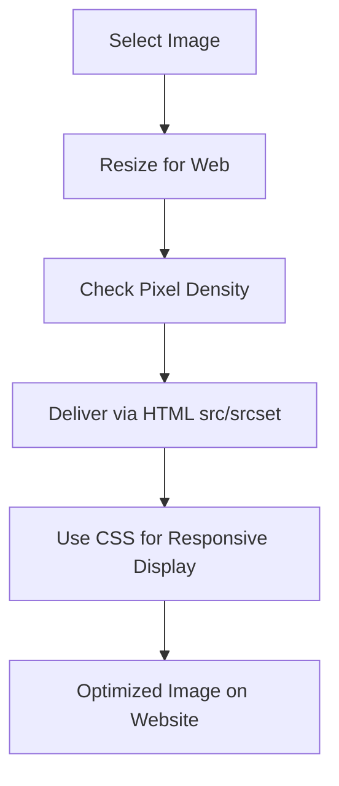

# Optimizing Images for the Web

## Overview

This video explains how to optimize images for faster website loading. Optimizing images is crucial for user experience, especially for mobile devices and high-density screens, to ensure quick load times and clear visuals.

## Main Concepts

### 1. Importance of Image Optimization

* Large images can slow down websites.
* Users expect instant loading; large files affect performance.
* Resizing image files reduces file size and improves speed.

**Example:**

```text
Original photo: 4000x3000 pixels
Optimized for web: 1000x750 pixels
```

**Explanation:** This reduces the file size significantly without losing quality for web display.

---

### 2. Determining Image Size

* The required image size depends on where it appears on the page.
* **Background images:** cover entire sections (homepage or resume header).
* **Project thumbnails:** 300px wide for larger screens, 500px wide for smaller screens.
* Avoid using smaller images and scaling them up, as it can pixelate the image.

**Tip:** Always maintain aspect ratio when resizing to prevent distortion.

---

### 3. Screen Pixel Density (PPI)

* Different screens have different pixel densities, measured in **pixels per inch (PPI)**.
* **Higher PPI** = sharper images and text.
* **Apple Retina displays:** 4x pixels in the same physical area.
* Deliver multiple versions of an image for standard and high-density screens.

**Example HTML:**

```html

```

**Explanation:** Standard screen uses 500px image; high-density screen uses 1000px image.

---

### 4. Using CSS for Responsive Images

* CSS can adjust image widths for desktop and mobile layouts.
* **Background images:** One image of 1500px-2500px is usually sufficient.
* CSS ensures the image fits different screen sizes without losing quality.

**Example CSS:**

```css
.hero-image {
  width: 100%;
  height: auto;
  background-size: cover;
}
```

**Explanation:** Makes the image cover the section responsively.

---

### 5. Tools for Resizing Images

* **Paid:** Photoshop, Shutterstock
* **Free/Online:** Adobe Express, free online image editors
* Adjust width; height auto-adjusts to maintain aspect ratio.
* Resize before adding CSS for accurate layout control.

---

## 🗝️ Key Points / Notes

* Large images slow down websites; always optimize.
* Consider image placement and screen pixel density.
* Use multiple versions for high-density screens.
* CSS can make images responsive.
* Use editing tools to resize images while maintaining aspect ratio.

---

## 🧩 Visual Summary



---

## ⚡ Quick Revision

✅ Resize images to reduce file size
✅ Use multiple versions for high-density screens (2x)
✅ Use CSS for responsive widths
✅ Maintain aspect ratio to avoid distortion
✅ Utilize free or paid image editing tools

---

<details>
<summary>🧩 Input Transcript</summary>

[Optimizing images for the web

* In the early days of the internet, waiting for an image to load was just the way it was, but these days, users want it to feel instant. To improve website speed, resizing image files will make them smaller in size. Most photos have dimensions of 4,000 by 3000 pixels or larger, which is used for print, but for the web, it's way too big. For faster load times, files should be as small as possible, especially for mobile devices, which may have data usage or internet speed restrictions. But what size should we use? Well, that depends on the amount of space it will take up on the page. In the course project, we'll be using a background image to cover the entire homepage and the header portion of the resume page. In the project section, the thumbnails will be set to 300 pixels wide for larger screens, and 500 pixels wide for smaller screens. But we can't just resize the image files to these dimensions because it also depends on the type of screen the website is being displayed on. Different screens have varying pixel densities, which refer to the number of pixels in a physical area on a screen. This is measured by pixels per inch, or PPI for short. Higher pixel densities result in sharper and more detailed images and text. For example, Apple's Retina displays have four times as many pixels per inch as non-Retina displays because they can fit two pixels within the same width and height. The term Retina is a trademark of Apple but it's often used to refer to high-density screens in general. To support screens with different pixel densities, use one image file for standard screens and another image file that's at least twice the size for screens with higher pixel densities. HTML can then be used to deliver the correct image file using the source attribute for the standard size image and the source set attribute for the larger image. The 2x descriptor indicates that the larger image is for displays with a 2x resolution. For the course project thumbnails, we can use the same image for both desktop and mobile screens. A 300-pixel versus a 500-pixel wide image won't significantly change the file size. We'll use the larger of the two, because using a smaller image file and styling it to be larger can pixelate the image. So for standard screens, the image will be 500 pixels wide, and for high-pixel density screens, it will be 1000 pixels wide. Then, we'll use CSS to adjust the widths for the desktop and mobile layouts. For the background images, sizing the file to be twice the size of an entire computer screen would be quite large. For this scenario, instead of creating two image files, using one that's 1500 pixels to 2500 pixels wide is usually big enough. The placeholder images included in the exercise files are already sized accordingly. If you're using your own images or want to find different stock photography options, you'll need to use image editing software like Photoshop to resize the files. There are also free online tools like Adobe Express and Shutterstock, which are used just for resizing images. When you resize the width of an image, the height is automatically adjusted as well to maintain the aspect ratio. You may need to adjust the height later, depending on the image you chose. It will become more apparent when we start adding CSS to our projects. Just a reminder, all these links are included in the Links.pdf file, as well as some additional resources about image files and optimization techniques.]

</details>
