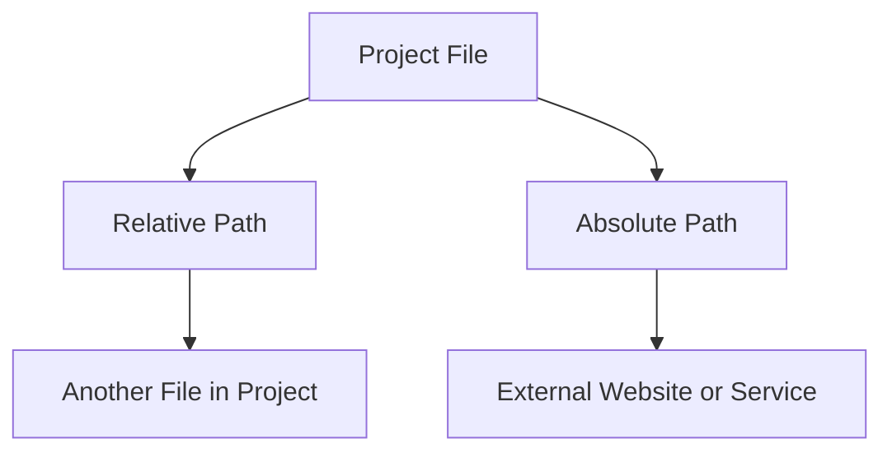

# Relative and Absolute Paths

## Overview

This video explains how to link files in a website project using **relative** and **absolute paths**. Understanding these paths is essential to properly organize your project and avoid broken links.

## Main Concepts

### 1. Relative Paths

Relative paths are used to link **files within the same project folder**. The path depends on the location of the file in the directory.

**Key points:**

* If files are in the same folder, just use the **file name**.
* To link a file in a subfolder: use `foldername/filename.ext`.
* Paths are **relative to the current file location**.
* File paths are **case-sensitive**; using all lowercase letters is recommended.

**Example:** Linking from `index.html` to `resume.html` in the same folder:

```html
<a href="resume.html">Resume</a>
```

Linking to a CSS file in a `css` folder:

```html
<link rel="stylesheet" href="css/style.css">
```

**Tip:** If you move a file, update the relative paths accordingly.

---

### 2. Absolute Paths

Absolute paths are used to link **external resources** outside your project.

**Key points:**

* Uses the **full URL** including protocol, domain, and file name.
* Commonly used to link to external websites.
* **Do not hotlink images** from other websites without permission; it uses their bandwidth.

**Example:**

```html

```

* Hotlinking without permission is discouraged.
* Services like **Lorem Picsum** provide placeholder images and allow absolute paths.
* Absolute paths are **required** for images hosted on live websites.

**Tip:** Use your own images or properly licensed stock images when launching a website.

---

## 🗝️ Key Points / Notes

* **Relative paths** link files **within your project**.
* **Absolute paths** link to **external resources** on the web.
* **Hotlinking** can misuse someone else's bandwidth.
* Always check **case sensitivity** for relative paths.
* Placeholder image services can be used temporarily with absolute paths.

---

## 🧩 Visual Summary



---

## ⚡ Quick Revision

✅ Relative paths: within project folders
✅ Absolute paths: external URLs
✅ Avoid hotlinking, use licensed or placeholder images
✅ Always check file names and case sensitivity

---

<details>
<summary>🧩 Input Transcript</summary>

[Relative and absolute paths

* [Instructor] When building websites, it's common to link different files together, such as embedding an image, linking to a CSS file, or even another website. This can be done using a relative or absolute path. Relative paths are used to link to files within the same project. The path is determined by the file's location within the directory. In the course project, the link to the resume page from the homepage uses a relative path. Since the HTML files are in the same folder, the file path is just the file name. To link to a file contained in a folder, start the file path with the folder name followed by a slash and the file name. These paths are relative to their location in the directory, so if you move a file, you'll need to update the paths accordingly. File paths are also case sensitive, so if you have a folder named css with lowercase letters, and you reference it with uppercase letters, the link may not work. To avoid potential issues, it's recommended to use all lowercase letters. Absolute paths are typically used for linking to external web resources outside of your project files. This method uses the full URL, including the protocol, domain name, and any directory or file names. Linking to a website or a specific webpage is usually okay because when someone follows that link, they're directed to another website. However, embedding a web resource, such as an image from one website into your own website, should be avoided. This is called hotlinking. If you are linking to a file on someone else's server, when a user visits your page, their browser will request the image from the original website server. This can consume the bandwidth of the hosting service that the website owner paid for and potentially cause the server to slow down or crash. Hotlinking is basically using resources without permission, unless, of course, you do have permission. There are services that are designed for hosting resources for others to use, such as the placeholder image service I mentioned in a previous lesson, Lorem Picsum. When using a service like this, an absolute path must be used because these images are hosted on a live website. Most placeholder image services will offer various options that will change the URL. Just make sure to copy the whole path into your project. Also, keep in mind that these services are meant to be temporary. When you're ready to launch a website, it's better to use your own images or license stock photography.]

</details>
