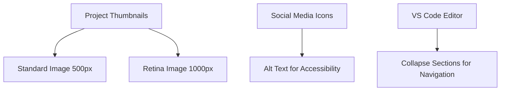

# Project: Adding Images and Icons

## Overview

This lesson teaches how to add project thumbnail images and social media icons to your website using HTML. It also covers handling high-resolution (retina) screens and organizing code in the text editor.

## Main Concepts

### 1. Adding Project Thumbnails

* **Locate images:** In your project folder, navigate to the `images` folder in VS Code.
* **Standard and Retina images:** Use 500px width images for standard screens and 1000px width images for high pixel density (retina) screens.
* **Updating HTML:**

  * Use the `src` attribute for the standard image.
  * Use the `srcset` attribute for the retina image.

**Example:**

```html

```

**Explanation:**

* `src` provides the default image.
* `srcset` with `2x` ensures retina displays use a higher resolution image.
* Always include a descriptive `alt` attribute for accessibility.

### 2. Adding Social Media Icons

* **Replacing text links:** Use an `` tag to replace text with icons.
* **Auto-complete shortcut:** Type `IMG` and press `Tab` in VS Code to create an image tag with default attributes.
* **Small icons:** These usually don’t need multiple resolutions.
* **Accessibility:** `alt` attribute should describe where the link leads.

**Example:**

```html
<a href="https://www.youtube.com/channel">
  
</a>
```

**Explanation:**

* The `<a>` tag wraps the image to make it clickable.
* The `alt` text ensures screen readers understand the purpose.

### 3. Collapsing Code in VS Code

* **Purpose:** Helps focus on specific sections by hiding nested code.
* **How to use:** Hover left of an HTML tag with nested elements and click the dropdown to collapse or expand.
* **Important:** Works only if HTML is properly indented.

**Benefits:**

* Easier navigation of long files.
* Reduces scrolling.
* Helps stay organized.

---

## 🗝️ Key Points / Notes

* Use `src` for standard images and `srcset` with `2x` for retina displays.
* Always include descriptive `alt` attributes for accessibility.
* Social media icons can replace text links; maintain clarity in `alt` text.
* Collapsing code blocks in VS Code helps manage long HTML files efficiently.
* Proper indentation is essential for editor features to work correctly.

---

## 🧩 Visual Summary



---

## ⚡ Quick Revision

✅ Add project images: use `src` and `srcset`.
✅ Add icons: use `` with meaningful `alt`.
✅ Collapse code blocks for easier editing.
✅ Ensure proper file paths and indentation.

---

<details>
<summary>🧩 Input Transcript</summary>

[Project: Adding images and icons
(upbeat music) - [Instructor] In this project update, let's take what we've learned about working with images and file paths and add the thumbnail images to the resume page and the icons to the footer. Back in the editor, let's start with updating the images in the project section in the resume.html file. To see your image files from within the text editor, click the arrow in the sidebar to expand the folder. I've added my own project thumbnails, which include two sets of image files with sizes optimized for standard screens set to 500 pixels, and for retina screens set to a thousand pixels. Using whichever image file you'd like for your first project block, update the source value with the standard image file. The starting point for this file is resume.html, so from here the browser will need to navigate to the images folder first. When adding file paths VS Code will show matches to the folders and files in your project. We can still manually type out the file name or press enter or return to use the auto complete feature. This will add the folder name and the slash. Now, the auto complete feature will show a list of images contained in the folder. When there's a list of options, you can use the up or down arrow keys to navigate to the correct file. Then press enter, or return to auto complete the rest of the file name or you can just click on the file that you wish to add. For me, it's project decoded YouTube 500 pixels.png. Let's leave the source set attribute for now and update the alt attribute with the description of the image to make it accessible for screen readers. My project thumbnail is just a collection of my YouTube thumbnails, so I'll add that to my alt description. Let's see how the standard image is displayed in the browser. Save the file and refresh the browser to see the updates. If you can't see your image, double check the source value. It should match exactly to the name of your folder, image and file extension, and make sure there are no spaces. By default, images are displayed in the same dimensions as the file size, which is currently 500 by 365 pixels, but we'll be changing the size later with CSS. I'm currently using a retina display, so the image appears to be a little blurry since we've only added the standard size image file. So, let's go back to the HTML file and add an option for high pixel density screens. Using the source set attribute, let's link to the 1000 pixel wide image. The auto complete feature for the source set attribute isn't showing the same options as for the source attribute, so make sure there's a slash after the images folder. And now, I'm going to link to the 1000 pixel image file. I'll just use this option and update this to 1000 pixels and add in the .png extension. Then, add a space followed by 2x. This will tell the browser to use the larger image for high pixel density screens. Let's save the file again and see how the larger image displays on a retina screen. This has improved the clarity of the image for my display. Now, let's continue to add the rest of the project images to your resume.html file. Just so you don't have to watch me type everything out, I'm going to copy and paste the values I have saved in a text file offscreen. Take a moment to update your image file paths. Once you've added all your project thumbnails, save the file and check the updates in the browser. We won't be adding the background images just yet. We'll be using CSS for that in a later exercise, but we do have some more images to add, the social media icons and the footer. Let's go back to the editor. Now, that I've personalized the content, the markup on the page is much longer than the template. Another useful editor feature is collapsing code blocks. Hover over the area to the left of an HTML tag that contains nested elements. A dropdown will appear. Click to collapse the code. Click it again to expand it. This feature helps you to focus on a particular section and navigate long pages more easily. Since I'm done with the project section for now, and it's quite long, I'm going to collapse this whole section. I'll also collapse the work experience and education section as well, since we're going to be focusing on the footer area. Now, I don't have to scroll through a long page of code. Also, note that this feature only works if your HTML is properly indented. So, this is another good reason to stay organized. For this section, I'd like to use the icon instead of text as the link to the social media accounts. So, I'll delete the text and add an image tag here instead. Here's another auto complete shortcut. Type the element name, IMG, but without the angled brackets. Then, press the tab key. This will add the image tag and the attributes. Then, add the icon image to the source attribute. My first link is for my YouTube channel, so the source value will be images icon logo YouTube.png. Since the images are pretty small, we don't have to worry about creating two different sizes, like we did for the project thumbnails. When using images, alt attributes should always be included, but when using an icon to replace the text, it's extra important. The alt attribute value should describe where the link will take the user. I'll update mine to say my YouTube channel. Continue with the same process for the rest of the social media links I'll paste in the rest of my links. After this is complete, make sure to update the homepage links as well. I'll collapse this as well to make it easier to copy the whole section and add it to my index.html. Going to replace this with the updated list. Now, let's save both files and check the updates in the browser. My third link is using the medium logo, which is white and the page background is also white, so it just looks like a blank spot right now, but it's there. The size and alignment also look off right now, but we'll be updating these styles with CSS later in the course. If you'd like to learn more about how to use functional images while maintaining accessibility, check out this tutorial from the W3C. The link is also included in the links.pdf file.]

</details>
