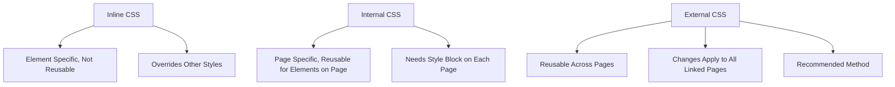

# Referencing CSS

## Overview

This video explains the three main ways to add CSS to your HTML: **inline**, **internal**, and **external**. It covers the pros and cons of each method and why the external method is recommended for most projects.

## Main Concepts

### 1. Inline CSS

**Inline CSS** is added directly to an HTML element using the **style** attribute.

**Example:**

```html
<p style="color: blue; font-size: 16px;">Hello, world!</p>
```

**Explanation:**

* Styles are applied directly to each element.
* Not reusable — must be added to each element individually.
* Multiple styles go in the same attribute, which can be messy.
* Overrides other CSS methods if conflicts occur.
* Use sparingly; difficult to maintain in large projects.

---

### 2. Internal CSS

**Internal CSS** is added inside the `<style>` tag in the **head** section of the HTML document.

**Example:**

```html
<head>
  <style>
    p {
      color: blue;
      font-size: 16px;
    }
  </style>
</head>
```

**Explanation:**

* Styles apply to all matching elements on the page.
* Can be reused on multiple elements within the same page.
* Must add the style block to each HTML page to reuse styles.
* Better than inline CSS, but still not ideal for large projects.

---

### 3. External CSS

**External CSS** uses a separate `.css` file that is linked to the HTML document with a `<link>` tag.

**Example:**

```html
<head>
  <link rel="stylesheet" href="styles.css">
</head>
```

**Explanation:**

* CSS is separated from HTML, improving readability and management.
* Can be shared across multiple HTML pages.
* Any change in the stylesheet updates all linked pages.
* Recommended method for most websites.

**styles.css** example:

```css
p {
  color: blue;
  font-size: 16px;
}
```

---

## 🗝️ Key Points / Notes

* **Inline CSS:** quick, not reusable, overrides other styles, hard to maintain.
* **Internal CSS:** reusable on the same page, harder to maintain across multiple pages.
* **External CSS:** reusable across pages, easier to manage, separates HTML and CSS, recommended.
* Always aim for maintainable and scalable CSS methods.

---

## 🧩 Visual Summary



---

## ⚡ Quick Revision

✅ Inline CSS: direct, not reusable, overrides other styles.
✅ Internal CSS: style block in head, reusable on page, harder across pages.
✅ External CSS: separate file, reusable across pages, best practice.

---

<details>
<summary>🧩 Input Transcript</summary>

[Referencing CSS

* [Instructor] Before we get into writing CSS, let's discuss three ways to add CSS to the HTML: inline, internal, and external. The inline method uses a style attribute added to the opening HTML tag. The CSS style rules are added as the value of the attribute. Since the styles are applied directly to each element, they are not reusable. Each style declaration must be added to each element, even if it's the same style. Also, multiple styles must be added to the same style attribute which can make it difficult to read and manage. Inline styles will override other CSS style rules added by other methods, potentially leading to conflicts. They should be used sparingly if at all since this method is not flexible and can be difficult to maintain. With the internal method, the CSS is added to the head section of the HTML document. All the CSS style rules are enclosed between style tags. CSS selectors can then be used to apply styles to all the matched elements instead of each element individually. In this example, p is the selector and will apply the style to all paragraph elements. To apply the same style to multiple HTML pages, the style block must be added to each page. So while this method is more flexible than inline CSS, it has its drawbacks too. Most websites require much more CSS than in the example, so this method can also become hard to maintain. The third option is the external method, which is the recommended option. This involves using a separate file for the CSS which is referenced in the HTML file using the link tag. This is a void HTML element so it doesn't need a closing tag. It's also included in the head section of the document. To link to the CSS file, include the rel attribute with the value of stylesheet, and the href attribute value is the path to the CSS file. An external stylesheet can be shared among multiple HTML files in the project by linking to the same CSS file. Any changes made to the stylesheet will be applied to all the HTML pages it's linked to. Of the three methods, using an external stylesheet is recommended because it separates the CSS from the HTML. It can be reused and it's easier to manage. As we move through this course, you'll see that there are often different ways to accomplish the same thing. I'll be sure to go over best practices to help you decide which option works best for each scenario.]

</details>
