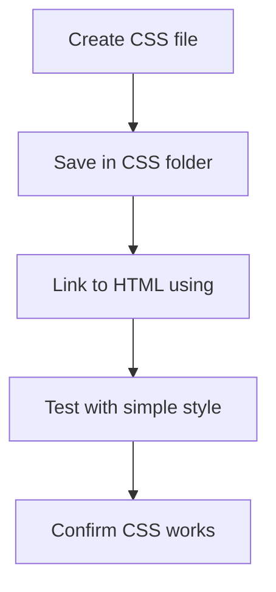

# Project: Creating a CSS File

## Overview

This video explains how to create a CSS file for your project and link it to HTML files. It emphasizes the importance of proper linking, testing, and initial setup for styling your webpage.

## Main Concepts

### 1. Creating a CSS File

* In your code editor, create a **new file** using File > New File or **Ctrl/Command + N**.
* Name the file meaningfully, e.g., `styles.css`, `global.css`, or your project name.
* Save the file in the **CSS folder** of your project.
* Ensure the file has a `.css` extension.

### 2. Linking CSS to HTML

* Use the **`<link>` tag** inside the `<head>` section of your HTML file.
* The `<link>` tag is a **void element**, so it does **not require a closing tag**.
* Basic syntax to link CSS:

```html
<link rel="stylesheet" href="css/styles.css">
```

* Steps:

  1. Add `rel="stylesheet"` to specify the type of link.
  2. Set `href` to the path of your CSS file (`css/filename.css`).
* Repeat the same `<link>` in all HTML files that need the CSS.

### 3. Testing the CSS Link

* Add a **test style** in the CSS file to verify linking:

```css
body {
    background-color: lightblue;
}
```

* Save the CSS file.
* Refresh your HTML page in the browser.
* If the background color changes, the CSS file is correctly linked.
* If not, check:

  * The CSS file path
  * Syntax errors
  * Whether the file is saved (dot in the tab indicates unsaved file)

### 4. Writing Basic CSS

* Start with a **selector** (e.g., `body`) followed by **curly braces `{}`**.
* Inside the braces, write **property-value pairs** ending with a **semicolon**.
* Example:

```css
body {
    background-color: green;
}
```

* Editors like VSCode can **autocomplete curly braces** and **suggest color names**.

---

## 🗝️ Key Points / Notes

* Always save your CSS file in the project folder.
* Use meaningful file names for easy maintenance.
* `<link>` tag is used to connect CSS with HTML.
* Test your CSS by adding a visible style before moving to complex styles.
* Check for common issues like incorrect paths or unsaved files if styles don't appear.

---

## 🧩 Visual Summary



---

## ⚡ Quick Revision

✅ Create a CSS file and save it in the CSS folder.
✅ Link the CSS file in all HTML files using `<link>`.
✅ Test the link with a visible CSS change.
✅ Correct any path or syntax issues if the style does not appear.

---

## 🧩 Input Transcript

<details>
<summary>Click to expand transcript</summary>

[Project: Creating a CSS file

* [Instructor] Now that we've completed all the project prep and HTML updates, the next step is to create a CSS file. In the editor, go to File, New File, or use the keyboard shortcut Command or Control + N. The CSS file can have any name, but it's common to use global, the project name, or styles, which is what I'll be using. Save it with a .css file extension. And add it to your CSS folder. Back in the index.html file, add the link tag, which can be included anywhere within the head section. I'll add mine under the title tag. Let's use the autocomplete shortcut again. Type the element name, link, but without the angled brackets, then press the tab key. Reminder, this is a void element, so it doesn't need a closing tag. Let's update the href value to point to the CSS file. Add the folder name first, which is css/ then the file name. Save the file, then copy this line and add it to the resume.html page as well. When starting a project, I like to do a small test by adding a style that you can't miss, like changing the page's background color. This ensures that the files are properly linked before adding more CSS. When something goes wrong, I often assume it's something complicated, but it's usually just a small error, like forgetting to link or save the file. I'll be going over the syntax for writing CSS in chapter two, but for now let's add this snippet to your CSS file. We'll start with body. Then I'll add a space and a left curly bracket, which is located beside the P key. The editor will automatically add the right curly bracket. Enter or return to move the cursor between and onto the next line. Most editors will also add a tab space automatically to indent the code for readability. Then we'll add background, colon, space, and pick any color value. Most common colors will work, like green, blue, or red. Also, as you start to type a color, VSCode will suggest some matches. End it with a semicolon. Now, let's save the file, then refresh the browser. Now we can see the background color on both pages, since they are both linked to the same CSS file. If you don't see the color change, double-check your CSS syntax and make sure you've saved the file. If you see a dot in the tab, that means your file isn't saved. If you do see the color change, then congrats. You've successfully linked your CSS file. Now we're ready to dive into some core CSS concepts.]

</details>
