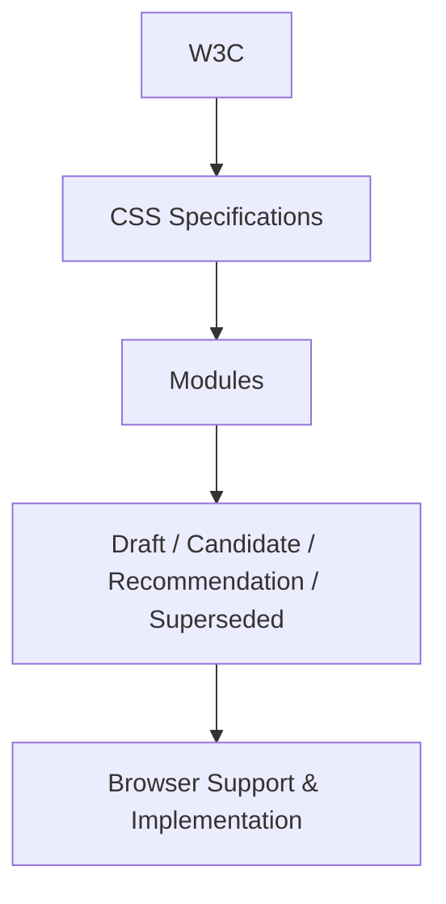

# CSS Specifications and the W3C

## Overview

This video explains the origin and structure of CSS specifications, the role of the W3C, and how developers can understand and use CSS effectively. It highlights the evolution of CSS from level 1 to modern modular updates and emphasizes the importance of using reliable resources.

## Main Concepts

### 1. W3C and CSS Specifications

**W3C** (World Wide Web Consortium) is the organization responsible for creating technical standards for CSS.

* CSS has rules that need to be followed for proper web styling.
* W3C publishes specifications that guide these rules.
* Developers don’t need to read the entire documentation word by word, but should know how to navigate and find relevant information.

**Example:**

```css
/* CSS syntax follows W3C specifications */
body {
  background-color: lightblue;
}
```

**Explanation:** This CSS follows the syntax rules defined by the W3C.

---

### 2. CSS Versions and Modules

* **CSS Level 1 & 2:** Originally published as complete documents.
* **After Level 2:** CSS specifications split into modules for easier and faster updates.
* **CSS3:** Refers to updates after CSS level 2, but levels now represent versions for individual modules, not the whole CSS.
* **Modules:** Each module focuses on a specific CSS feature (like selectors, colors, etc.) and can be updated independently.

**Analogy:** Think of CSS modules as chapters in a book; you can update one chapter without rewriting the entire book.

---

### 3. Understanding Status Codes in CSS Modules

CSS modules use **status codes** to indicate their development stage:

* **Draft:** Experimental features, may not be supported in all browsers, can change or be removed.
* **Candidate/Proposed Recommendation:** Formalized after feedback and approval, generally stable.
* **Recommendation:** Current standard suitable for production use.
* **Superseded Recommendation:** Old version replaced by a newer spec.

**Example:**

```css
/* Using a standard recommendation feature */
div {
  display: flex; /* Flexbox is a recommended CSS feature */
}
```

**Explanation:** This Flexbox feature is widely supported and follows W3C recommendations.

---

## 🗝️ Key Points / Notes

* W3C defines all technical CSS specifications.
* CSS specifications are modular and updated independently.
* Levels are specific to modules; CSS3 is just a term for post-level 2 updates.
* Status codes indicate stability and browser support.
* Developers should use resources like Mozilla Developer Network (MDN) for easier learning.

---

## 🧩 Visual Summary



---

## ⚡ Quick Revision

✅ W3C sets CSS rules and standards.
✅ CSS is now modular; each module can be updated independently.
✅ Status codes (Draft, Candidate, Recommendation) show stability and usage readiness.
✅ Use MDN or W3C guides for reference and continuous learning.

---

## 🧩 Input Transcript

<details><summary>Click to expand</summary>

[CSS specifications and the W3C

* When writing any coding language, there are specific rules to follow. For CSS, the W3C is the organization that creates the technical specifications. When I started learning CSS, I was determined to read the whole thing. However, I found that reading the W3C guidelines was a little intimidating. There was a lot of unfamiliar jargon, and it was quite extensive. So needless to say, I didn't finish it. But just like any other reference manual, you don't need to read it word for word. You just need to know how to find what you're looking for, and how to read the documentation. Since the W3C is responsible for establishing these rules, you'll probably end up looking at it at some point. So let's go over the publishing process to better understand where CSS specifications come from, and how to keep up to date with the changes. All of the past, current, and working drafts are published on the W3C website. The first two versions, CSS level 1 and CSS level 2, were published as one whole document. After level 2, the specification was split into modules, so each module could be updated independently, which allowed for faster updates. For example, we can see the full CSS level 2 specs right here. And for just selectors, we can see it's currently at level 3. The term CSS3 refers to any updates after CSS level 2, but since the specs are now split into modules, levels no longer refer to versions of CSS as a whole. The levels are just versions for that particular module, so there's no need to make a distinction. It's all just CSS. When you select a module, you'll get all the information about that particular CSS concept, like what it's used for and how to use it. There are also colors and status codes used to show what phase the particular module is at. Here's an explanation for the status codes. Features in the draft stages are experimental, and may not be supported by all browsers. They can also be changed or removed. Candidate or proposed recommendations become formalized after feedback and approval. Standards at this phase are usually okay to start implementing. The current standard for the latest browsers is recommendation, while superseded recommendation is a spec that has been replaced by a newer version. You don't need to read the entire specification to write CSS, but it's good to have some understanding of the process. In this course, I'll cover the essentials of CSS, but learning everything there is to know about CSS is more than what we can do in a few hours. So continuous learning is an important part of the process. It's also good to have some go-to resources, like the Mozilla Developer Network's CSS Guide, which is a friendlier read, and it links back to the W3C guides if you need more information. Now that we know where the CSS specs come from, let's get into the core concepts.]

</details>
