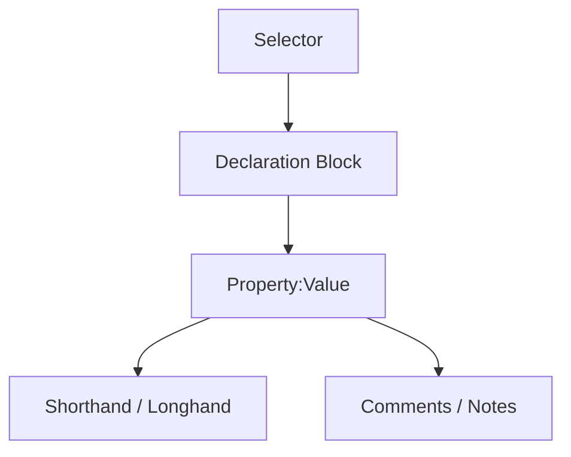

# CSS Syntax and Terminology

## Overview

This video explains the basic syntax and terminology of CSS. Understanding these concepts is important because CSS is the language used to style web pages. Knowing the correct syntax helps you write clear, readable, and functional code.

## Main Concepts

### 1. CSS Syntax

CSS syntax is like grammar in a spoken language. Proper syntax allows the computer to understand your instructions.

* **Declaration Block:** A section of CSS enclosed in curly brackets `{ }` containing one or more style rules.
* **Selector:** Specifies which HTML element(s) the style will apply to.
* **Declarations:** Individual CSS style rules consisting of **property-value pairs**.

  * **Property:** Defines what aspect of the element you are styling (e.g., `background`, `color`, `padding`).
  * **Value:** Specifies the exact style (e.g., `pale turquoise`, `10px`).
* **Format:** Property and value are separated by a colon `:` and each declaration ends with a semicolon `;`.

**Example:**

```css
/* Style the body element */
body {
    background: pale turquoise;
    font-size: 16px;
}
```

**Explanation:**

* `body` is the **selector**.
* `{ ... }` is the **declaration block**.
* `background: pale turquoise;` and `font-size: 16px;` are **declarations**.

---

### 2. Shorthand and Longhand Properties

CSS allows you to use **shorthand properties** to set multiple styles at once, or **longhand properties** to define each individually.

* **Shorthand Example:**

```css
padding: 10px 20px 10px 20px;
```

* **Longhand Example:**

```css
padding-top: 10px;
padding-right: 20px;
padding-bottom: 10px;
padding-left: 20px;
```

**Tip:** Shorthand is efficient, longhand gives more control.

---

### 3. Comments in CSS

Comments are notes for developers and do not affect styling.

* **Syntax:** `/* comment text here */`
* Can be used to describe sections or temporarily disable code.

**Example:**

```css
/* Header styles */
header {
    background: #00ced1; /* pale turquoise */
}
```

**Usage:** Helps with readability and debugging.

---

### 4. White Space in CSS

White space helps organize CSS for readability but also has functional uses.

* **Required white space:** Separates multiple property values (e.g., `10px 20px`).
* **Optional formatting:** Indents, line breaks, and spaces improve readability.

**Example:**

```css
body {
    margin: 10px 20px;
    color: black;
}
```

**Tip:** Consistency in formatting is important, especially in team projects.

---

## 🗝️ Key Points / Notes

* CSS syntax is made up of **selectors**, **declaration blocks**, **properties**, and **values**.
* **Shorthand properties** simplify code; **longhand properties** provide more control.
* Use **comments** to explain code or temporarily disable it.
* Proper **white space** improves readability and prevents syntax errors.

---

## 🧩 Visual Summary



---

## ⚡ Quick Revision

✅ CSS syntax = grammar for styling web pages
✅ Declaration block: `{ property: value; }`
✅ Shorthand sets multiple properties at once; longhand sets them individually
✅ Comments = `/* text */`
✅ White space helps readability and separates multiple values

---

## 🧩 Input Transcript

<details><summary>Click to expand</summary>

[CSS syntax and terminology
- Learning to code is similar to learning a spoken language. You start by learning the grammar rules. In coding, syntax is like the grammar rules of the coding language, and using proper syntax is how we give instructions to the computer. Let's take a look at the CSS we added to our last project exercise and review the syntax in terminology. This is a declaration block. It may contain one or more style rules enclosed in curly brackets. A selector specifies which HTML element or elements to apply the style to. CSS style rules are called declarations and use property value pairs to provide instructions to the browser on how to style a specific HTML element. The property specifies what is being styled like background. The value defines the specific characteristics such as the color pale turquoise. They are separated by a colon and end with a semicolon to indicate the end of the rule. There are many CSS properties and values, and they all have different effects on the appearance and behavior of HTML elements. We'll go over different properties and values throughout the course. Some CSS styles can be defined using shorthand properties, which set multiple styles in one statement. Longhand properties set values individually. For example, padding is shorthand for padding top, padding right, padding bottom, and padding left. Shorthand is generally more efficient since only one declaration is needed, but longhand properties can be used if you need to define just one characteristic. Comments are used to add notes to your CSS. They don't affect the styling of the webpage and are ignored by browsers, so we can use them to help us read our code better. The syntax starts with a slash and asterisk and ends in the opposite order. Write your comment using text, numbers or any type of characters as long as they are between the asterisks. For example, notes, instructions, or extra information can be left for yourself or for your team. In this example, the comment describes where the styles are applied, the header area, and what color the hex code represents. To debug or experiment without deleting the CSS, you can temporarily hide it by commenting out a line or a whole block. Just add the slash and asterisk before and after the section or line you want to hide. White space in CSS is used in a couple different ways. Sometimes it's required syntax. For example, multiple property values must be separated by a space. Without it, the value will not be valid and the styles will not be applied. Other times it's used to format the code. If we wrote the CSS with only the required white space, the browser would still be able to read it. But writing CSS like this would be difficult for us to read. It's common to write each declaration on a separate line and to indent them to easily see which block they're contained in. Adding spaces between selector names and the curly brackets and between property value pairs can also improve readability. As we go through different CSS concepts, I'll be sure to mention when white space is required in the syntax. This is also something to pay attention to when reading documentation. When it comes to formatting, developers tend to have strong opinions, including myself. There have been countless debates and style guides written about this, such as this one: codeguide.co. Some of these rules may not make sense right now since we've only just started talking about CSS, but you can save this guide for later. As you write more code, you'll develop your own style. My advice is to do what makes sense to you but try to be consistent. And if you're working on a team, I would recommend defining a cohesive style guide together.]

</details>

