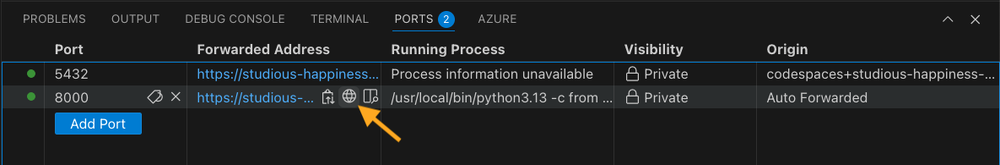
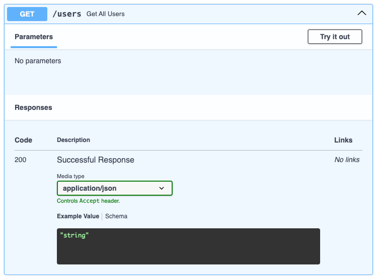
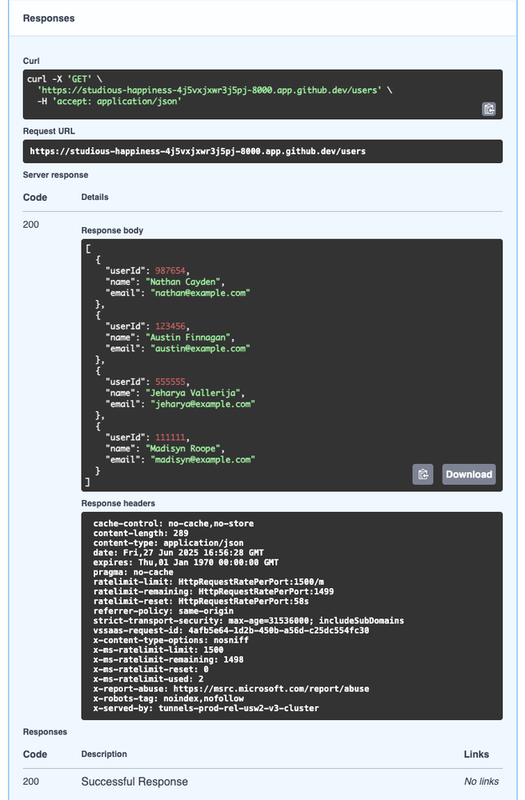
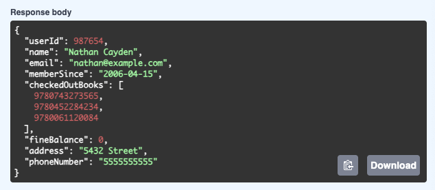

# Hands-On REST API Practice

The best way to learn how REST APIs work is to work directly with them. The web is full of REST APIs, some private, some public, some with open access, others with restricted access, and there are also dedicated services for experimenting with REST. That said, all of these services are external and administered by third parties. 

To give you a sandbox where you can safely experiment with a REST API you have full control over, I’ve updated the course with custom exercise files hosted on GitHub. The exercise files provide a virtual environment with a database and REST API for an imaginary library. The database has user profiles, a catalogue of books, and methods for checking books in and out.

This is your own private REST API you can work with and manipulate in any way you want without relying on external services or worrying about access, data security, or anyone else seeing what you are doing!

In the next chapters, you’ll find text articles with exercises to get hands-on practice with REST APIs. Use the exercise files in Codespaces to follow along.

## Setting up the exercise files

1. Go to the exercise files repo for the course.
2. Click the green “Code” button.
3. Select the “Codespaces” tab and click “Create codespace on master” or select an existing codespace you’ve already created.
4. The codespace setup will take a while (up to several minutes) due to all the moving parts. You’ll know it’s ready when you see a pop-up in the bottom corner telling you a new web server is available on localhost.

## Stopping and restarting the REST API service

The codespace is set up to start the REST API service automatically. You’ll see it running in the Terminal output, and this is also where  you control it:

- To stop the REST API service at any time, go to Terminal and press `Ctrl + C`.
- To start the REST API service, go to Terminal and run `uvicorn main:app --reload`

## Accessing the REST API from your browser

The REST API will start running by default under a random URI generated by Codespaces.

You can inspect the REST API in your browser by clicking the “Open in browser” button in the pop-up or by selecting the Ports tab in the bottom panel, hovering over the `Forwarded` `Address` column for the `8000` port, and clicking the URI or the little globe symbol:

The root page for the REST API has a single line of text:

*"Welcome to the Library REST API. Add /docs to the URL to see API methods."*

Add `/docs` to the end of the URL in the address bar. This gives you a FastAPI user interface where you can inspect the endpoints and methods in the REST API:

## Using the FastAPI interface

Here’s how to use this interface to find information about a specific user:

First, expand the GET /users container:

Next, select the “Try it out” button and then the “Execute” button.

The GET request is sent to the `/users` endpoint and the panel expands to show the Response body, Response header, and other information:

In the Response body, copy the `userID` from one of the users.

Next, expand the Get `/users/{user_id}` panel, select the “Try it out” button, paste in the user ID in the `user_id` field, and select the “Execute” button.

In the Response body, you now see all the information about the specific user:

## Your sandbox to explore

Now that you have a general idea of how this interface works, take a few minutes to explore it in detail. This is your private sandbox to explore. There is no risk of doing anything wrong here, so try things and see what happens.

The very worst thing that can happen is that your database gets corrupted or the codespace crashes. If so, go back to the GitHub repo, select the green “Code” button and the “Codespaces” tab, delete the existing codespace, and create a new one. You’re now starting again with a clean slate!