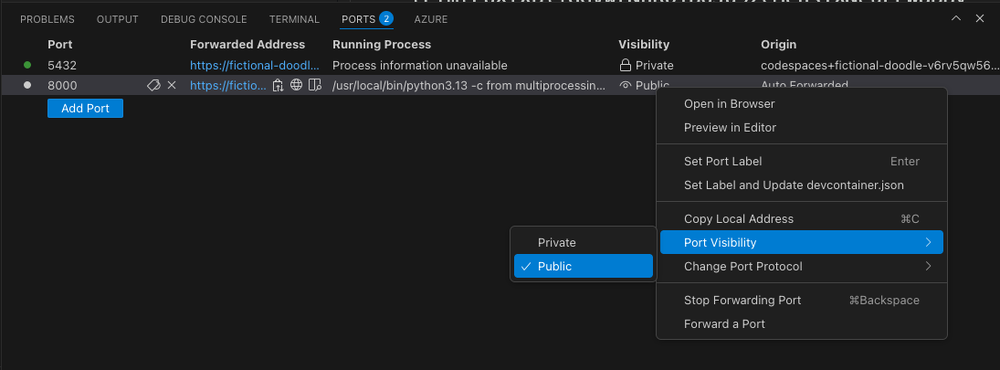
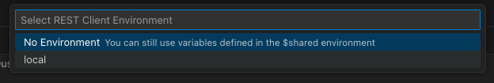
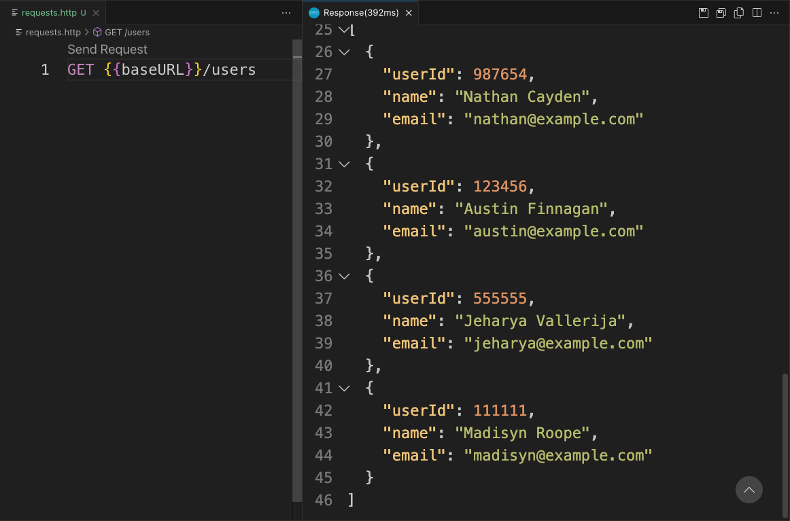

# Exploring GET Requests

There are a myriad of tools available to explore and interact with REST APIs, and you can even do it directly through the Terminal using CURL.

The exercise files codespace comes with a VS Code REST client extension installed that allows you to create requests and save them for further use. The REST client kicks in when you open any file with the extensions `.http` or `.rest`. In the exercise files, you have one such file to start: `requests.http`. You are free to make as many as you like. 

Let’s use this extension to explore GET requests.

## Make the REST API available to VS Code

Before you can query the REST API you need to make it available to VS Code. This requires changing the port from Private to Public:

1. Select the Ports tab in the bottom panel.
2. Find the row for the 8000 port.
3. In the “Visibility” column, right-click on “Private”.
4. In the pop-up menu, select “Port Visibility -> Public”.

Changing the Port visibility for individual ports.



## Set up a variable for the REST API URL

The REST Client VS Code extension supports variables. These allow you to make quick changes without having to repeat yourself. Since the URL for the REST API is auto-generated by the codespace and is long and awkward, setting it up as a variable makes it a lot easier to work with.

The easiest way to set up variables is to define and use them in the same file:

1. Select the Ports tab in the bottom panel.
2. Find the row for the `8000` port.
3. Under the “Forwarded Address” column, copy the URL.
4. Open the `requests.http` file.
5. At the very top type in `@baseURL`, then a space, and then paste in the URL.
6. You can now access the variable like this: `{{baseURL}}`.

You can set up as many variables as you like using the @ symbol and a variable name.

For multi-file projects, you can also set up your variables in the `.vscode/settings.json` file. If you do, remember to remove any duplicate variables from your files first to avoid conflicts.

1. In the settings file, find this property:

```
"rest-client.environmentVariables": {
  "local": {}
}
```

2. Place the cursor inside the curly braces after "local" and create a new line. Add the following: `"baseURL": "[your-random-url"` and make sure to remove the trailing / at the end of the URL:

```
"rest-client.environmentVariables": {
  "local": {
    "baseURL": "https://some-random-name-8000.app.github.dev"
  }
}
```
3. Open `requests.http`.

4. In the status bar at the very bottom of the editor, click “No Environment.” This opens a selector at the very top of the editor.

5. In the selector, choose “local”.

6. In the file, access the variable the same way as before: `{{baseURL}}`.

The selector for the REST Client Environment appears when you click the Environment button on the bottom status bar.



## Get a list of users from the REST API

To get a list of all users from the REST API you need to send a GET request to the /users endpoint:

1. Open the requests.http file. 
2. Type in GET followed by the baseURL variable or the REST API URL and the /users endpoint: GET {{baseURL}}/users.
3. Click the “Send request” button directly above the request, and a new panel opens to the side showing the REST response.

The request on the left, the response on the right. Note the response panel has been scrolled to the bottom to show the response body.



The response tab shows you the headers and the response body. 

*Note: Because you are using GitHub Codespaces there is a humongous Set-Cookie value in the header you have to scroll past to get to the response body.*

## Get a specific user based on user ID

To get a specific user, the GET request needs to include the user ID. 

1. In the response body, copy the value from of the `userID` fields.
2. In `requests.http` create a couple of new lines and then add a new request:
    `GET {{baseURL}}/users/[userID]`.
3. Select “Send Request” and the Response panel updates.

## GET endpoints in the REST API

Now that you know how to use the REST Client to send GET requests, explore the API and try different requests. You can see all the available GET endpoints listed in the FastAPI UI. For reference, they are:

- GET `/users/` - Gets all users
- GET `/users/{user_id}` - Gets the specified user based on ID
- GET `/books/` - Gets all books
- GET `/books/{isbn}` - Gets the specified book based on ISBN