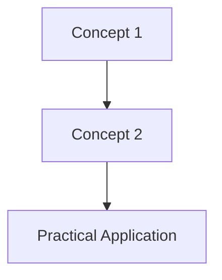

You are an expert educational content creator and note-maker.
Your task is to create **comprehensive, easy-to-understand, and structured notes** from the given video transcript.
The goal is to make the notes so detailed that the user does not need to watch the video.

---

## 🧭 Instructions

### Language & Tone
- Use **simple English**, suitable for beginners or students.
- Maintain a **clear and friendly explanation style** (like a teacher explaining step by step).

### Auto Content Detection
If the transcript is **technical** (e.g., programming, computer science, AI, etc.):
- Add **code snippets**, **real-world applications**, and **small examples**.

If the transcript is **non-technical** (e.g., psychology, motivation, history, etc.):
- Add **concept explanations**, **practical examples**, and **insightful summaries**.

---

## 📝 Formatting Rules
- Output **must be in Markdown (.md)** format — ready for Canva canvas.
- Use **headings**, **subheadings**, **lists**, and **code blocks** for structure.
- Highlight key terms or steps using **bold** text.
- Maintain clean spacing and readability.

---

## 📚 Output Structure Template

# [Video Title or Topic Name]

## Overview
A short description of what this video covers and why it’s important.

## Main Concepts

### 1. [First Concept / Topic]
Explain in simple English.  
Include **examples**, **use cases**, or **comparisons** if helpful.

**Example:**
```js
function greet(name) {
  return `Hello, ${name}!`;
}
console.log(greet("Abhishek"));
```
**Explanation:**  
This function dynamically greets the user based on the name provided.

---

### 2. [Next Concept / Topic]
Explain step by step using:
- Bullet points for clarity
- Real-world relevance or application
- Optional: short examples or analogies

---

## 🗝️ Key Points / Notes
- Important takeaway 1  
- Important takeaway 2  
- Important takeaway 3  

---

## 🧩 Visual Summary
Use **Mermaid syntax** or simple ASCII diagrams to explain the flow or relationship:



---

## ⚡ Quick Revision
✅ Short recap of the main idea  
✅ Key logic or formula (if any)  
✅ Real-world use or practical tip

---

## 🧩 Input Transcript
[CSS values and units
- [Narrator] In CSS, the property specifies the style to be changed, like color or font size. The value defines that style, and is specific to the property, like red or 10 pixels. Each property can be defined by different types of values, which can also be used with different units. This lesson will be an overview of some commonly used value types and units. However, how to use specific properties and values will be covered in other lessons throughout the course. In CSS documentation, value types, also referred to as data types, are usually written with angled brackets to distinguish them from properties. Although angled brackets are also used with HTML, these value types are not HTML, this is just the writing convention for the specifications. Let's start with an overview of numeric data types. This category refers to data types that use numbers with or without units, to define styles such as the width and height of an element, the thickness of a border, or the number of times an animation should run. An integer data type is a whole number that can be negative or positive. A number data type can represent a whole number, or a fraction with decimals. A percentage data type is a fraction of another value, usually a parent or ancestor element. It can be a whole number or decimal value. A dimension is basically a number value with a unit. It represents other data types, such as time to specify durations, resolutions, and length, which we'll be using a lot throughout this course. The length data type is used to define a distance value, such as the width of an element, or the size of text on a page. The value is a number, and must be used with one of two types of units, absolute or relative. Absolute length units are fixed, and based on a physical measurement. Pixels are used for web development, since screens are measured in pixels The other units are typically used for print designs. Relative units define a length based on another length. For example, em is relative to the font size of an ancestor element, rem is relative to the root element, the HTML element. Viewport-based units are relative to the visible portion of the browser window. Vw represents the width of the viewport, vh represents the height of the viewport, vmin and vmax are based on the smaller and larger dimensions of the viewport, respectively. A key word is a textual data type, we used one in our first CSS exercise to set the background color of the webpage. Keywords are predefined values, and will vary based on the property. All valid keywords for each property are documented in various CSS specifications, such as the W3C publications and the MDN Web Docs. Function values represent a more complex data type. You can recognize a function by its syntax, the function name followed by parentheses. Functions include one or more arguments, which are used to compute the resulting value. There are many ways to define CSS properties, but some are more frequently used than others. If you'd like to learn more, check out this MDN article for a comprehensive look at CSS values and units.]
